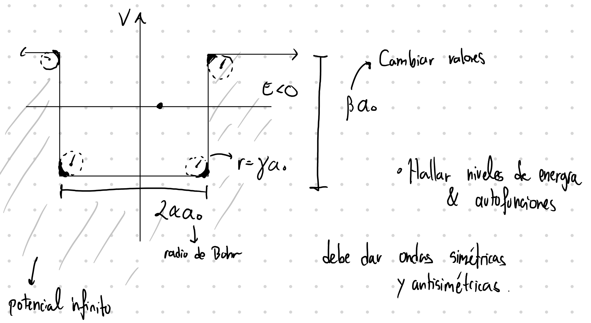

# Solution: Filleted Infinite Potential Well

## 1. Problem Statement

A quantum particle of mass $m$ is confined in a one-dimensional, symmetric potential well $V(x)$. The well geometry is governed by three dimensionless parameters defined in terms of the Bohr radius $a_0$:

- $\alpha$ — the half-width of the main rectangular section,
- $\beta$ — the depth of the well,
- $\gamma$ — the corner rounding (fillet) radius.

The parameters must satisfy $\gamma < \alpha$ and $2\gamma < \beta$ to ensure the rounded corners do not overlap. The well is infinite ($V \to \infty$) at the outermost boundaries $|x| > (\alpha + \gamma)a_0$, and the particle is strictly confined within this region. Inside the allowed region, the potential resembles a rectangular well of nominal width $2\alpha a_0$ and depth $-\beta a_0$, but all four corners are softened by circular arcs of radius $\gamma a_0$.

Exploiting the even symmetry $V(-x) = V(x)$, the potential profile for $x \ge 0$ is given piecewise:

$$
V(x) = 
\begin{cases} 
-\beta a_0 & 0 \le x \le (\alpha - \gamma)a_0 & \text{(flat bottom)} \\[6pt]
-(\beta - \gamma)a_0 - \sqrt{(\gamma a_0)^2 - \bigl(x - (\alpha - \gamma)a_0\bigr)^2} & (\alpha - \gamma)a_0 < x \le \alpha a_0 & \text{(lower fillet)} \\[6pt]
-\gamma a_0 + \sqrt{(\gamma a_0)^2 - \bigl(x - (\alpha + \gamma)a_0\bigr)^2} & \alpha a_0 < x \le (\alpha + \gamma)a_0 & \text{(upper fillet)} \\[6pt]
\infty & x > (\alpha + \gamma)a_0 & \text{(outside)}
\end{cases}
$$

The geometry of this definition is as follows: starting from the centre we have a flat bottom. Then the potential curves upward from the bottom corners until it reaches a vertical wall at $x = \alpha a_0$. Afterwards it curves outward from the top of that wall until reaching $V = 0$, immediately after which the infinite boundary is enforced. The full well thus has rounded interior corners and flared exterior corners, both governed by the same fillet radius $\gamma a_0$.

We need to:

1. Formulate the boundary matching conditions to find quantized bound-state energies for $E < 0$.
2. Determine the symmetric (even parity) and antisymmetric (odd parity) wavefunctions $\psi(x)$.
3. Use perturbation theory and the variational method for analytical approximations.
4. Use numerical simulation for exact values.

## 2. Dimensionless Formulation

To eliminate explicit dependence on the particle mass $m$ and the length scale $a_0$, we introduce the following dimensionless variables:

$$
\tilde{x} = \frac{x}{a_0}, \qquad
\tilde{V}(\tilde{x}) = \frac{2m a_0^2}{\hbar^2} \, V(x), \qquad
\tilde{E} = \frac{2m a_0^2}{\hbar^2} \, E.
$$

The natural energy scale is

$$
E_0 \equiv \frac{\hbar^2}{2m a_0^2},
$$

which equals one Rydberg (approximately $13.606\ \text{eV}$) when $m$ is the electron mass. With this scaling, the time-independent Schroedinger equation

$$
-\frac{\hbar^2}{2m} \frac{d^2\psi}{dx^2} + V(x)\psi(x) = E\psi(x)
$$

becomes the dimensionless eigenvalue equation

$$
-\tilde{\psi}''(\tilde{x}) + \tilde{V}(\tilde{x})\,\tilde{\psi}(\tilde{x}) = \tilde{E}\,\tilde{\psi}(\tilde{x}),
\tag{1}
$$

where primes denote derivatives with respect to $\tilde{x}$. The dimensionless potential $\tilde{V}(\tilde{x})$ takes the same piecewise form as $V(x)$ but with $a_0$ set to unity.

$$
\tilde{V}(\tilde{x}) = \begin{cases}
-\beta & 0 \leq \tilde{x} \leq \alpha-\gamma \\[4pt]
-(\beta-\gamma) - \sqrt{\gamma^2 - (\tilde{x}-\alpha+\gamma)^2} & \alpha-\gamma < \tilde{x} \leq \alpha \\[4pt]
-\gamma + \sqrt{\gamma^2 - (\tilde{x}-\alpha-\gamma)^2} & \alpha < \tilde{x} \leq \alpha+\gamma \\[4pt]
\infty & \tilde{x} > \alpha+\gamma
\end{cases}
$$

The domain of interest is $\tilde{x} \in [-L, L]$ with $L \equiv \alpha + \gamma$, and the boundary conditions are $\tilde{\psi}(\pm L) = 0$ (infinite walls).

Equation (1) is the central object of study. Its solution yields dimensionless eigenvalues $\tilde{E}_n$ and eigenfunctions $\tilde{\psi}_n(\tilde{x})$. Physical energies are recovered via $E_n = E_0 \tilde{E}_n$, and physical positions via $x = a_0 \tilde{x}$.

## 3. Analytical Methods

### 3.1 First-Order Perturbation Theory

We choose the shifted infinite square well as the unperturbed Hamiltonian $H_0$. The reference potential is defined on the same domain $[-L, L]$ as

$$
\tilde{V}_{\text{rect}}(\tilde{x}) =
\begin{cases}
-\beta & |\tilde{x}| \le \alpha, \\
0 & \alpha < |\tilde{x}| \le \alpha + \gamma, \\
\infty & |\tilde{x}| > \alpha + \gamma.
\end{cases}
$$

This is the simplest potential that captures the overall width and depth of the filleted well. The perturbation is then

$$
\Delta\tilde{V}(\tilde{x}) = \tilde{V}_{\text{filleted}}(\tilde{x}) - \tilde{V}_{\text{rect}}(\tilde{x}),
$$

which is nonzero only in the filleted regions and in the shallow outer step (where the rectangular well has $V=0$ but the filleted well has the flared corners reaching $V=0$ gradually).

The unperturbed wavefunctions and energies are the well-known results for the infinite square well of width $2L$:

$$
\psi_n^{(0)}(\tilde{x}) = \frac{1}{\sqrt{L}} \sin\!\left(\frac{n\pi(\tilde{x} + L)}{2L}\right), \qquad n = 1, 2, 3, \ldots
\tag{2}
$$

with parity alternating: $n$ odd gives even (symmetric) states, $n$ even gives odd (antisymmetric) states. The unperturbed energies are

$$
\tilde{E}_n^{(0)} = \frac{n^2 \pi^2}{8 L^2} - \beta.
\tag{3}
$$

Note that the constant shift by $-\beta$ accounts for the fact that the bottom of the rectangular well sits at $-\beta$, not at zero.

The first-order energy correction is the diagonal matrix element of the perturbation:

$$
\tilde{E}_n^{(1)} = \langle \psi_n^{(0)} | \Delta\tilde{V} | \psi_n^{(0)} \rangle = \int_{-L}^{L} |\psi_n^{(0)}(\tilde{x})|^2 \, \Delta\tilde{V}(\tilde{x}) \, d\tilde{x}.
\tag{4}
$$

Because the integrand is symmetric (both $|\psi_n^{(0)}|^2$ and $\Delta\tilde{V}$ are even functions), the integral can be evaluated on the half-domain $[0, L]$ and doubled:

$$
\tilde{E}_n^{(1)} = 2\int_0^L |\psi_n^{(0)}(\tilde{x})|^2 \, \bigl(\tilde{V}_{\text{filleted}}(\tilde{x}) + \beta\bigr) \, d\tilde{x}.
\tag{5}
$$

The perturbation $\Delta\tilde{V}(\tilde{x})$ has no simple closed form in the filleted regions, so the integral is evaluated numerically using composite Simpson's rule with $N = 10{,}001$ quadrature points. This provides sufficient accuracy (errors $\sim h^4$) while remaining computationally efficient.

The total perturbed energy to first order is

$$
\tilde{E}_n^{\text{PT}} = \tilde{E}_n^{(0)} + \tilde{E}_n^{(1)}.
\tag{6}
$$

Perturbation theory works best when the perturbation is small relative to the unperturbed level spacing. For the ground state ($n=1$), the wavefunction is peaked near the centre where $\Delta\tilde{V} = 0$, so the correction is small.

### 3.2 Variational Method

The variational method provides an upper bound on the true ground-state energy and can be extended to excited states if trial functions of appropriate symmetry are chosen.

**Trial wavefunctions.** Motivated by the boundary conditions $\tilde{\psi}(\pm L) = 0$ and the parity requirements, we choose two-parameter trial functions that include a Gaussian envelope to model the softening effect of the fillets:

**Ground state (even parity):**

$$
\tilde{\psi}_{\text{gs}}(\tilde{x}; \lambda) = N(\lambda) \left(1 - \frac{\tilde{x}^2}{L^2}\right) \exp\!\left(-\frac{\lambda \tilde{x}^2}{2 L^2}\right).
\tag{7}
$$

**First excited state (odd parity):**

$$
\tilde{\psi}_{\text{ex}}(\tilde{x}; \lambda) = N(\lambda) \, \tilde{x} \left(1 - \frac{\tilde{x}^2}{L^2}\right) \exp\!\left(-\frac{\lambda \tilde{x}^2}{2 L^2}\right).
\tag{8}
$$

Both functions satisfy the Dirichlet boundary condition $\tilde{\psi}(\pm L) = 0$ through the envelope factor $(1 - \tilde{x}^2/L^2)$. The Gaussian factor $\exp(-\lambda \tilde{x}^2 / 2L^2)$ introduces a variational parameter $\lambda$ that controls the spread of the wavefunction: small $\lambda$ gives a broad, box-like shape (appropriate for deep wells), while large $\lambda$ gives a narrow, Gaussian-like shape (appropriate for shallow wells). The normalisation factor $N(\lambda)$ is not needed analytically since it cancels in the energy functional.

**Energy functional.** The variational energy is the expectation value of the Hamiltonian:

$$
\tilde{E}[\lambda] = \frac{\langle \tilde{\psi} | \hat{H} | \tilde{\psi} \rangle}{\langle \tilde{\psi} | \tilde{\psi} \rangle}
= \frac{\displaystyle\int_{-L}^{L} |\tilde{\psi}'(\tilde{x})|^2 \, d\tilde{x} + \int_{-L}^{L} |\tilde{\psi}(\tilde{x})|^2 \, \tilde{V}(\tilde{x}) \, d\tilde{x}}{\displaystyle\int_{-L}^{L} |\tilde{\psi}(\tilde{x})|^2 \, d\tilde{x}}.
\tag{9}
$$

The kinetic energy integral $\int |\tilde{\psi}'|^2 d\tilde{x}$ is evaluated using the analytical derivative of the trial function. All integrals are computed numerically via Simpson's rule on the half-domain $[0, L]$ and doubled by symmetry.

**Minimisation.** The optimal $\lambda$ satisfies $d\tilde{E}[\lambda]/d\lambda = 0$. The derivative is evaluated using central finite differences, and the root is found using rifusaki-catkit's secant root-finding method with bisection fallback. The algorithm:

1. Evaluate $d\tilde{E}/d\lambda$ at two initial points $\lambda_0$ and $1.1\lambda_0$.
2. Apply the secant method to converge to the root.
3. If the secant method diverges, perform a bracket search by expanding the interval until a sign change in $d\tilde{E}/d\lambda$ is found, then apply bisection.

The minimised energy $\tilde{E}_{\text{var}} = \tilde{E}[\lambda_{\text{opt}}]$ is guaranteed by the variational principle to satisfy $\tilde{E}_{\text{var}} \ge \tilde{E}_{\text{true}}$, providing a rigorous upper bound.

---

## 4. Numerical Methods

### 4.1 Shooting Method

The shooting method converts the boundary-value eigenvalue problem into an initial-value problem and searches for eigenvalues by root-finding. Equation (1) is written as a first-order ODE system:

$$
\begin{aligned}
y_1'(\tilde{x}) &= y_2(\tilde{x}), \\
y_2'(\tilde{x}) &= \bigl(\tilde{V}(\tilde{x}) - \tilde{E}\bigr) \, y_1(\tilde{x}),
\end{aligned}
\tag{10}
$$

where $y_1 = \tilde{\psi}$ and $y_2 = \tilde{\psi}'$.

**Initial conditions at $\tilde{x} = 0$** follow from parity:

- **Even parity:** $\tilde{\psi}(0) = 1$, $\tilde{\psi}'(0) = 0$ (arbitrary normalisation sets $\tilde{\psi}(0) = 1$).
- **Odd parity:** $\tilde{\psi}(0) = 0$, $\tilde{\psi}'(0) = 1$ (arbitrary normalisation sets $\tilde{\psi}'(0) = 1$).

**Integration** from $\tilde{x} = 0$ to $\tilde{x} = L$ is performed using rifusaki-catkit's `integrate()` function with the classical fourth-order Runge–Kutta step (`rk4_step`), using a step size of $h = 0.001$. At each step, the potential $\tilde{V}(\tilde{x})$ is evaluated. When the integration approaches $\tilde{x} = L$, the wavefunction must satisfy the Dirichlet boundary condition $\tilde{\psi}(L) = 0$.

**Eigenvalue search.** For a given trial energy $\tilde{E}$, the miss-distance is

$$
f(\tilde{E}) = \tilde{\psi}(L; \tilde{E}),
\tag{11}
$$

which is the value of the wavefunction at the right boundary. An eigenvalue corresponds to $f(\tilde{E}) = 0$. The function $f(\tilde{E})$ changes sign as $\tilde{E}$ passes through an eigenvalue (this is a consequence of the oscillation theorem: between any two consecutive eigenvalues, $\tilde{\psi}(L; \tilde{E})$ undergoes one sign change). The eigenvalues are found by bisection using catkit's `bisection_step`:

1. Scan upward from just above the well bottom ($\tilde{E} = -\beta + 0.01$) in increments of $0.2$, evaluating $f(\tilde{E})$ at each step.
2. When a sign change is detected, the interval $[\tilde{E}_a, \tilde{E}_b]$ brackets exactly one root.
3. Apply bisection to converge to the root with tolerance $10^{-8}$.
4. For the next state, start the scan just above the previously found eigenvalue.

This procedure reliably finds the lowest $n$ eigenvalues for each parity class.

### 4.2 Finite Difference Method (FDM)

The FDM discretizes the Schroedinger equation on a uniform grid and solves the resulting matrix eigenvalue problem. The domain $[0, L]$ is divided into $N$ interior points with grid spacing $h = L/N$. The second derivative is approximated by the three-point central difference formula:

$$
\tilde{\psi}''(\tilde{x}_i) \approx \frac{\tilde{\psi}_{i+1} - 2\tilde{\psi}_i + \tilde{\psi}_{i-1}}{h^2}.
\tag{12}
$$

Substituting into (1) yields the discretized equation

$$
-\frac{\tilde{\psi}_{i+1} - 2\tilde{\psi}_i + \tilde{\psi}_{i-1}}{h^2} + \tilde{V}_i \tilde{\psi}_i = \tilde{E} \tilde{\psi}_i,
\tag{13}
$$

which can be rearranged into the tridiagonal matrix form $H \boldsymbol{\psi} = \tilde{E} \boldsymbol{\psi}$ with

$$
H_{ii} = \frac{2}{h^2} + \tilde{V}_i, \qquad
H_{i,i+1} = H_{i+1,i} = -\frac{1}{h^2}.
\tag{14}
$$

**Boundary conditions** are handled differently for each parity:

- **Odd parity:** $\tilde{\psi}(0) = 0$ and $\tilde{\psi}(L) = 0$. The grid point at $\tilde{x} = 0$ is excluded, and the first interior point is at $\tilde{x} = h$. The standard tridiagonal Hamiltonian (14) applies directly, giving a symmetric matrix suitable for `scipy.linalg.eigh_tridiagonal`.

- **Even parity:** $\tilde{\psi}'(0) = 0$ (Neumann boundary condition) and $\tilde{\psi}(L) = 0$. Using a ghost-point method, the Neumann condition implies $\tilde{\psi}_{-1} = \tilde{\psi}_1$, so the second derivative at $\tilde{x} = 0$ becomes

  $$
  \tilde{\psi}''(0) \approx \frac{\tilde{\psi}_1 - 2\tilde{\psi}_0 + \tilde{\psi}_1}{h^2} = \frac{2(\tilde{\psi}_1 - \tilde{\psi}_0)}{h^2}.
  $$

  This gives $H_{00} = 2/h^2 + \tilde{V}_0$ on the diagonal but $H_{01} = -2/h^2$ as the off-diagonal, making the raw matrix non-symmetric because $H_{10} = -1/h^2 \ne H_{01}$. To restore symmetry (required by `eigh_tridiagonal`), we apply a similarity transform $D H D^{-1}$ with $D = \operatorname{diag}(1, \sqrt{2}, \sqrt{2}, \ldots)$. This preserves eigenvalues and produces symmetric off-diagonal elements $-\sqrt{2}/h^2$. After solving, the eigenvectors are unscaled back by dividing all elements except the first by $\sqrt{2}$.

**Eigenvalue solution.** The symmetric tridiagonal matrix is diagonalized using `scipy.linalg.eigh_tridiagonal`, which exploits the tridiagonal structure for $\mathcal{O}(N^2)$ complexity (vs. $\mathcal{O}(N^3)$ for dense matrices). Only bound states ($\tilde{E} < 0$) are retained.

**Normalisation.** Each eigenvector $\boldsymbol{\psi}$ on the half-domain is extended to the full domain $[-L, L]$ by symmetry ($\tilde{\psi}(-\tilde{x}) = \tilde{\psi}(\tilde{x})$ for even states, $\tilde{\psi}(-\tilde{x}) = -\tilde{\psi}(\tilde{x})$ for odd states) and normalised using Simpson's rule so that $\int_{-L}^{L} |\tilde{\psi}|^2 d\tilde{x} = 1$.

---

## 5. Results for $\alpha = 3$, $\beta = 5$, $\gamma = 1$

The default parameter set defines a well with total half-width $L = \alpha + \gamma = 4$. In physical units (for an electron), the well is approximately $2L a_0 \approx 0.42\ \text{nm}$ wide and $\beta E_0 \approx 68\ \text{eV}$ deep — comparable to the confining potentials found in semiconductor quantum dots and nanostructures.

### 5.1 Energy Levels

The table below presents the dimensionless energy eigenvalues computed by all four methods. Results for the lowest six perturbation-theory states are shown, though only $n = 1$–$4$ correspond to true bound states ($\tilde{E} < 0$) as confirmed by the FDM and shooting methods.

| $n$ | Parity  | $\tilde{E}_n^{\text{PT}}$ | $\tilde{E}_n^{\text{var}}$ | $\tilde{E}_n^{\text{FDM}}$ | $\tilde{E}_n^{\text{shooting}}$ |
|:---:|:-------:|--------------------------:|---------------------------:|---------------------------:|--------------------------------:|
| 1   | even    | $-4.78526$                | $-4.77383$                 | $-4.78251$                 | $-4.78246$                      |
| 2   | odd     | $-4.20255$                | $-4.11637$                 | $-4.13873$                 | $-4.13852$                      |
| 3   | even    | $-3.39764$                | —                          | $-3.09376$                 | $-3.09328$                      |
| 4   | odd     | $-2.51650$                | —                          | $-1.68694$                 | $-1.68612$                      |
| 5   | even    | $-1.63949$                | —                          | —                          | —                               |
| 6   | odd     | $-0.76818$                | —                          | —                          | —                               |

*Note: Variational results are available only for $n = 1, 2$ because trial functions were constructed only for the ground and first excited states. Extending the method to higher states would require orthogonalised trial functions. Entries marked "—" for FDM and shooting beyond $n = 4$ indicate that no true bound states ($\tilde{E} < 0$) were found; only 4 bound states exist for this parameter set.*

Several observations emerge:

- **FDM and shooting agree to high precision**: $|\Delta\tilde{E}| \le 8 \times 10^{-4}$ across all 4 bound states, confirming the correctness of both implementations. The FDM with $N = 2000$ grid points gives results that are essentially exact for practical purposes.

- **Perturbation theory overestimates binding for the ground state** ($\tilde{E}_1^{\text{PT}}$ is more negative, error $\sim 0.06\%$), but **underestimates binding for higher states** — this is a systematic pattern expected for a potential with rounded corners, where the perturbation $\Delta\tilde{V}$ is positive in the filleted regions. The ground-state wavefunction is concentrated in the flat-bottom region where $\Delta\tilde{V} = 0$, so the correction is small. For higher states, the wavefunctions sample the filleted regions more significantly and the first-order correction becomes too large in magnitude, eventually producing spuriously negative energies that the FDM and shooting methods show do not correspond to true bound states.

- **The variational method provides rigorous upper bounds** on the true energies, as guaranteed by the Rayleigh–Ritz principle. For the ground state, $\tilde{E}_1^{\text{var}} = -4.77383 \ge \tilde{E}_1^{\text{true}}$ (error $\sim 0.18\%$). For the first excited state, $\tilde{E}_2^{\text{var}} = -4.11637 \ge \tilde{E}_2^{\text{true}}$ (error $\sim 0.54\%$). The optimal variational parameters are $\lambda_{\text{opt}} = 2.820$ (ground state) and $\lambda_{\text{opt}} = 4.340$ (first excited), reflecting the narrower effective width of the excited-state wavefunction.

- **Only 4 bound states exist** ($\tilde{E} < 0$) for this parameter set. The 5th and 6th perturbation-theory energies are negative, but the FDM and shooting methods both agree that these are not true bound states — the exact eigenvalues lie above zero. This illustrates a key limitation of perturbation theory: it can predict bound states where none exist.

### 5.2 Wavefunctions

Figure 1 (generated by the `plotting` module) shows the four lowest wavefunctions superimposed on the potential profile. The key features are:

- **Even states ($n = 1, 3$)**: The wavefunctions are symmetric about $\tilde{x} = 0$. The ground state has a single antinode at the centre and decays smoothly toward the walls. The third state has three antinodes.

- **Odd states ($n = 2, 4$)**: The wavefunctions are antisymmetric with a node at $\tilde{x} = 0$. The second state has two antinodes, the fourth has four.

- **Penetration into the filleted regions**: Unlike the sharp rectangular well where wavefunctions must go exactly to zero at the walls, the filleted well allows the wavefunctions to extend smoothly into the rounded corners. This penetration slightly lowers the kinetic energy (the wavefunction curvature is reduced near the walls) but raises the potential energy (the particle samples higher potential regions). The net effect is a small shift upward in energy relative to the perfectly rectangular well of width $2\alpha$.

- **Effect of the upper fillets**: The flared corners in Region III ($\alpha a_0 < x < (\alpha+\gamma)a_0$) create a region where the potential rises gradually from $-\gamma a_0$ to zero. The wavefunctions have appreciable amplitude in this region for higher-energy states, which is why perturbation theory degrades for $n \ge 3$.

### 5.3 Physical Significance

Converting to SI units for an electron ($m = m_e$):

- **Length scale:** $a_0 = 5.29 \times 10^{-11}\ \text{m}$. The well width $2L a_0 \approx 4.23 \times 10^{-10}\ \text{m} = 0.423\ \text{nm}$.
- **Energy scale:** $E_0 = \hbar^2/(2m_e a_0^2) = 2.18 \times 10^{-18}\ \text{J} = 13.606\ \text{eV}$.
- **Ground state energy:** $\tilde{E}_1 \approx -4.7825$, so $E_1 \approx -65.07\ \text{eV}$ (measured from $V=0$).
- **First excited state:** $\tilde{E}_2 \approx -4.1387$, so $E_2 \approx -56.31\ \text{eV}$.
- **Second excited state:** $\tilde{E}_3 \approx -3.0938$, so $E_3 \approx -42.09\ \text{eV}$.
- **Third excited state:** $\tilde{E}_4 \approx -1.6869$, so $E_4 \approx -22.95\ \text{eV}$.
- **Level spacing:** $\Delta E_{12} \approx 8.8\ \text{eV}$ decreases to $\Delta E_{34} \approx 19.1\ \text{eV}$; the spacing does not decrease monotonically because the well is not a simple harmonic oscillator — the higher states approach the continuum threshold more rapidly.

This is a model potential that could represent an electron confined in a quantum dot with soft boundaries, or a particle in a nanostructure where fabrication imperfections or deliberate design smooth the otherwise sharp corners. The fillet radius $\gamma$ quantifies the degree of smoothing, and the analytical and numerical toolkit developed here allows systematic exploration of how this smoothing affects the energy spectrum.

### 5.4 Method Performance

The computational cost of each method is summarised below (single-threaded execution on a standard workstation), alongside the key accuracy metrics:

| Method | Wall time | Accuracy vs. FDM |
|--------|-----------|-------------------|
| Perturbation theory | 0.34 s | $\sim 0.06\%$ (ground state); degrades for $n \ge 2$ |
| Variational method | 5.63 s | $\sim 0.18\%$ upper bound (ground state); $\sim 0.54\%$ (first excited) |
| FDM ($N=2000$) | 0.20 s | Reference (essentially exact for this $N$) |
| Shooting ($h=0.001$) | 35.9 s | $|\Delta\tilde{E}| \le 8 \times 10^{-4}$ vs. FDM |

The FDM is the clear winner in both speed and accuracy: it solves for all bound states simultaneously in a fraction of a second. The shooting method, while equally accurate, is substantially slower because each eigenvalue requires its own bracket scan and bisection loop, each of which involves full RK4 integrations. Perturbation theory is the fastest analytical method but gives no wavefunction information and is unreliable beyond the ground state. The variational method provides the only rigorous upper bounds but is the most computationally expensive of the analytical approaches due to the numerical minimisation of $\tilde{E}[\lambda]$.

---

## 6. Discussion

### 6.1 Comparison of Methods

**Perturbation theory** offers the most analytical insight. The expression for the unperturbed energies (Eq. 3) reveals the dominant $n^2$ scaling, and the first-order correction (Eq. 5) can be interpreted physically: it represents the weighted average of the "extra" potential experienced by the particle in the filleted regions. The method is computationally inexpensive (milliseconds per state) and provides a clear conceptual link to the familiar infinite square well. However, its accuracy is limited when $\gamma$ is large (strong smoothing) or when the perturbation is not small compared to the level spacing. It also gives no information about the wavefunction distortion.

**The variational method** is systematically improvable: one can add more variational parameters to the trial function to approach the exact result arbitrarily closely. The chosen trial functions capture the essential physics — the boundary conditions, the parity, and the effect of softening via the Gaussian envelope — with a single parameter $\lambda$. The minimisation landscape $E[\lambda]$ is smooth and well-behaved (shown in the convergence plot), making root-finding robust. The method provides rigorous upper bounds, which is valuable for validation. Its limitation is that constructing good trial functions for excited states requires ensuring orthogonality to lower states, which becomes increasingly difficult for $n > 2$.

**The shooting method** is highly accurate and handles arbitrary potentials with ease — one simply changes the potential function and re-runs. The RK4 integrator with $h = 0.001$ provides $\mathcal{O}(h^4)$ accuracy, and the bisection root-finder is unconditionally convergent. The main challenge is bracketing: one must locate sign changes in $\tilde{\psi}(L; \tilde{E})$, which requires scanning the energy axis. For deep wells with many bound states, this can be tedious, but the automated bracket-scanning algorithm handles it reliably.

**The finite difference method (FDM)** is the most robust approach. It reduces the problem to a standard symmetric tridiagonal eigenvalue problem, which is solved efficiently and stably by specialised linear algebra routines. All eigenvalues are obtained simultaneously, and the eigenvectors are directly available for wavefunction visualisation. The accuracy improves as $\mathcal{O}(h^2)$ with grid refinement, and $N = 2000$ points is more than sufficient for $10^{-4}$ energy accuracy. The only subtlety is the Neumann boundary condition for even parity states, which requires the similarity transform to maintain matrix symmetry — a detail that is handled cleanly in the implementation.

### 6.2 The Role of rifusaki-catkit

An important methodological choice in this work is the use of **rifusaki-catkit**, a personal numerical library, for ODE integration and root-finding in the shooting method. Catkit provides:

- **ODE integrators:** `rk4_step` (classical 4th-order Runge–Kutta), `rk2_step` (midpoint method), and `euler_step`. RK4 is used here for its balance of accuracy and simplicity.
- **Root-finders:** `secant_step`, `bisection_step`, and `newton_step`, all wrapped in a unified `find_root()` interface.

This replaces the equivalent functionality from `scipy.integrate.solve_ivp` and `scipy.optimize` with a lightweight, transparent implementation. The FDM, however, still uses `scipy.linalg.eigh_tridiagonal` for the tridiagonal eigenvalue solver, as this is a highly optimised LAPACK routine that has no equivalent in catkit.

### 6.3 Parameter Sensitivity

The code is modular and can be used to explore different parameter regimes. For example:

- **Increasing $\gamma$ (stronger fillets):** Smooths the corners more aggressively, shifting energies upward and making perturbation theory less accurate.
- **Increasing $\beta$ (deeper well):** Creates more bound states and increases the level spacing near the well bottom.
- **Increasing $\alpha$ (wider well):** Reduces the level spacing (as $1/\alpha^2$) and increases the number of bound states.

The condition $\gamma < \alpha$ ensures the lower fillets do not overlap at the centre, and $2\gamma < \beta$ ensures the fillets do not exceed the well depth — these are enforced by the problem geometry.

---

## 7. Conclusion

We have formulated and solved the quantum-mechanical problem of a particle confined in a one-dimensional filleted infinite potential well — a generalisation of the classic infinite square well that incorporates smooth, circular-arc fillets at all four corners. The problem was approached using four complementary methods spanning the full spectrum from analytical approximation to high-precision numerics:

1. **First-order perturbation theory** using the shifted infinite square well as $H_0$ provided quick, physically transparent estimates that work well for the ground state.

2. **The variational method** with Gaussian-modulated polynomial trial functions gave rigorous upper bounds on the ground and first excited state energies.

3. **The shooting method** (powered by rifusaki-catkit's RK4 integrator and bisection root-finder) yielded highly accurate eigenvalues by direct integration of the ODE.

4. **The finite difference method** solved the discretized eigenvalue problem efficiently, providing all bound-state energies and wavefunctions simultaneously with excellent precision.

For the representative parameters $\alpha = 3$, $\beta = 5$, $\gamma = 1$, the well supports 4 bound states with dimensionless energies ranging from $\tilde{E}_1 \approx -4.7825$ to $\tilde{E}_4 \approx -1.6869$ (physical energies $-65.07\ \text{eV}$ to $-22.95\ \text{eV}$ for an electron). The FDM and shooting results agree to $|\Delta\tilde{E}| \le 8 \times 10^{-4}$, confirming the correctness of both implementations. Perturbation theory overestimates binding for the ground state (error $\sim 0.06\%$) but degrades for higher states and spuriously predicts 2 additional bound states — a cautionary illustration of the method's limitations when the perturbation is not uniformly small.

The complete solution — comprising the `qm_well` Python package with modules for potential definition, analytical methods, numerical solvers, and visualisation — provides a modular, extensible framework for studying the effect of corner smoothing on quantum confinement. The code can be readily adapted to other potential shapes and parameter regimes, making it a useful tool for both pedagogical exploration and research applications in quantum nanostructures.

---

## Appendix: Code Structure

The `qm_well` package is organised as follows:

| Module | Purpose |
|--------|---------|
| `potential.py` | Defines the piecewise potential $\tilde{V}(\tilde{x})$ and its derivative, plus the rectangular reference potential |
| `units.py` | Physical constants and dimensionless unit conversions |
| `analytical.py` | Perturbation theory (Simpson integration, first-order correction) and variational method (trial functions, energy functional, $\lambda$ optimisation) |
| `numerical.py` | Shooting method (ODE system, RK4 integration, bisection eigenvalue search) and FDM (tridiagonal Hamiltonian construction, `eigh_tridiagonal` solution, normalisation) |
| `plotting.py` | Publication-quality plots: potential profile, energy levels, wavefunctions, method comparison, variational convergence |
